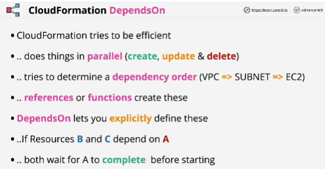
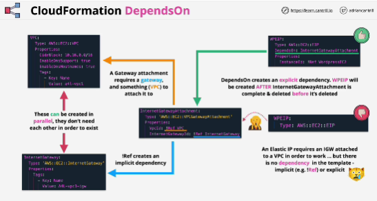

- **DependsOn** allows you to establish formal dependencies between resources within CloudFormation templates.

- **Exception**:
**Creating Elastic IP**: if you're creating elastic IP and you want to associate it with a VPC that you are creating in the same template, then it actually requires an attached internet gateway.

If you're deleting stack and CloudFormation attempts to delete internet gateway attachment before deleting the elastic IP, then you are going to get an error.

- With the DependsOn attribute you can specify that the creation of a specific resource follows another. 
When you add a DependsOn attribute to a resource, that resource is created only after the creation of the resource specified in theDependsOn attribute.

- You can specify a list of resources if you want to create multiple dependencies.

