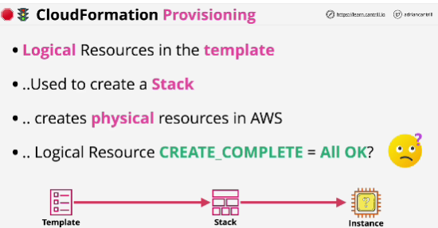
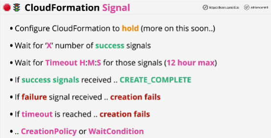
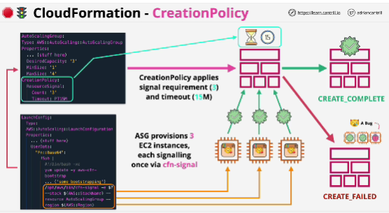
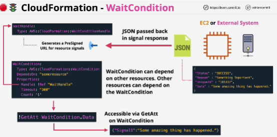

- **cfn-signal** is a utility running on the instance itself actually sending a signal back to the CloudFormation service.

- cfn-signal can send success signals or failure signals and a failure signal explicily fails the process.

- Actual thing which is being signaled using cfn-.signal is a logical resource

- **Creation policies** are generally used for EC2 instances or for auto-scaling groups.

- A **WaitCondition** is a specific logical resource, not something defined in an existing resource. They allow a specific resource creation to be paused, not allowing progress until signaling is received.

- WaitCondition relies on a **WaitHandle** (logical resource whose sole job is to generate a pre-signed URL which can be used to send signals to)

