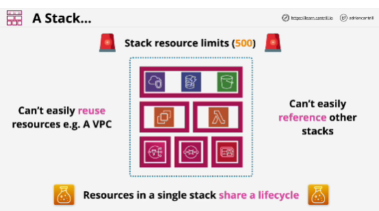
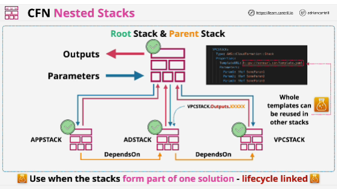
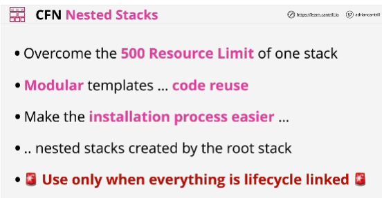

- Limitation: 500 resource per stack

- Stacks are, by default, **isolated**

- Two ways to architect a multi-stack project:
1. nested stacks
2. cross-stack references

## nested stacks
- Root stack is the only component of a nested stack which gets created manually by an entity, either a human or a software process.

- A root stack can contain and create nested stacks .. each of which can be passed parameters and provide back outputs.

- Nested stacks should be used when the resources being provisioned share a lifecycle and are related.

- For every parameter that the template has for this nested stack, we need to provide a value as we create it. If not, the stack creation process will fail.
**Exception** to this: if VPC stack template had default values for its parameters.

- Root stack can take the outputs from one nested stack and give them as parameters to another.

- When using nested stacks, you're reusing the template, not the actual stack.

- Used when all of the infrastructure that you're creating is forming part of the same solution, when lifecycle is linked.

