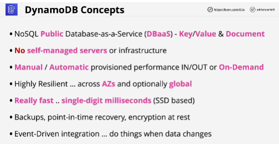
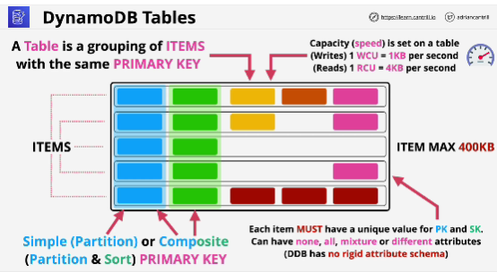
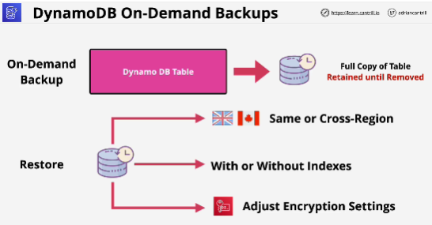
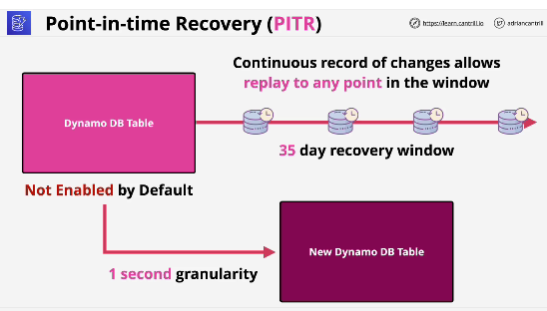
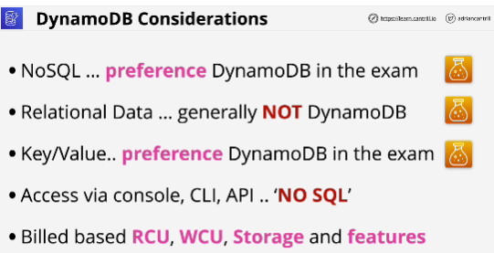

- **DynamoDB** is a NoSQL fully managed Database-as-a-Service (DBaaS) product available within AWS.

- **Tables** are base entity inside DynamoDB.

- If the primary key is a composite key, then the combination of the two parts, the PK and SK need to be unique in that table.

- In DynamoDB, capacity means speed.  
Adding more capacity means adding more speed, more performance.

- In **On-demand capacity model** you don't have to set explicit values for capacity on a table (cost per operation)

- **Provisioned capacity**: you need to explicitly set the capacity values on a per-table basis.

- **Write Capacity Units** (WCU) when set on a table means that you can write one kilobyte of data per second to that table.

- **Read Capacity Units** (RCU) when set on a table, means that you can read four kilobyte of data per second from that table.

- **On-demand backups** are similar to how manual RDS snapshot function. 
You're responsible for performing the backup and removing the older backups as needed when they're no longer required.

- **Point-in-time recovery**: you need to enable it on per-table basis.

- You pay only for the resources that you consume, either storage, operations, or capacity requirements that you specify on a table.

