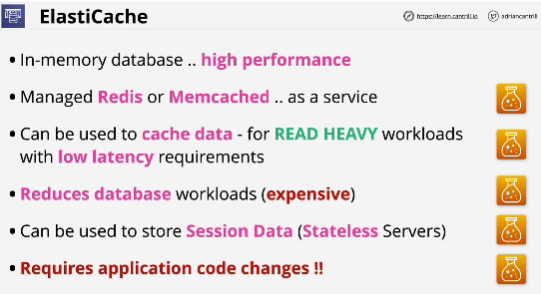
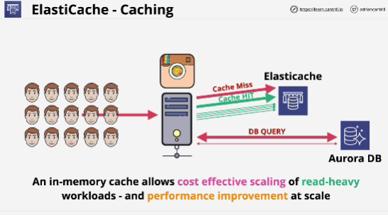
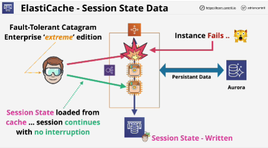
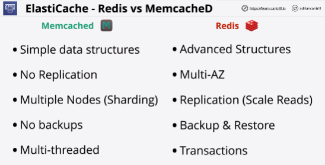

- **Elasticache** is a managed in-memory cache which provides a managed implementation of the redis or memcached engines.

- In-memory cache holds data in memory which is orders of magnitude faster, both in terms of throughput and latency, but it's not persistent, it's used for temporary data.

- **Read-heavy workloads**: ElastiCache can reduce the workloads on a database.

- Using Elasticache means that you need to make application changes.

**No application changes - Elasticache won't be suitable solution.**

- Use of Elasticache: storing user session data externally to application instances, allowing the application to be built in a stateless way

- Elasticache provides access to two different engines: **Redis and Memcached**

## Redis and Memcached
- Both engines offer sub-millisecond access to data

- Both support a range of programming languages

- Memcached supports only strings

- Types of architecture which would benefit from an in-memory cache: 
    - anything that has read-heavy workloads 
    - where you need to reduce the cost of accessing databases
    - where you need sub-millisecond access to data
    - where you need to store user session state data in an external way, not using EC2 instances
