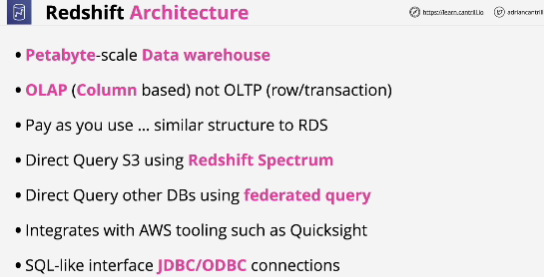
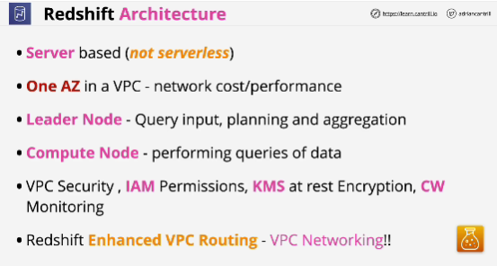
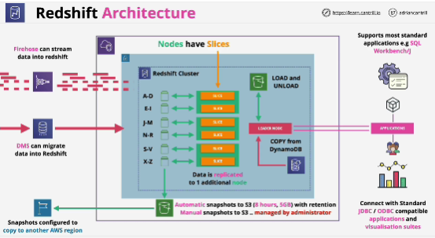

- It's a petabyte scale because it's been designed from the ground up to support huge volumes of data.

- Online transaction processing (OLTP) captures, stores, and processes data from transactions in real time.
Designed for transactions, inserts, modifies, and deletes.

- **Online analytical processing (OLAP)** is designed for complex queries to analyze aggrefated historical data from OLTP systems.

- Stores data in columns

- **Redshift spectrum** allows querying of data on S3 without loading it into Redshift in advance.

- **Federated query** allows you to directly query data that's stored in remote data sources.

- Cluster is a private network.

- Not HA

- VPC service

- By default, Redshift uses public routes for traffic when communicating with external services or any AWS services such as S3 when it's loading in data.

- **If you do have any customized networking requirements, then you need to enable enhanced VPC routing.

