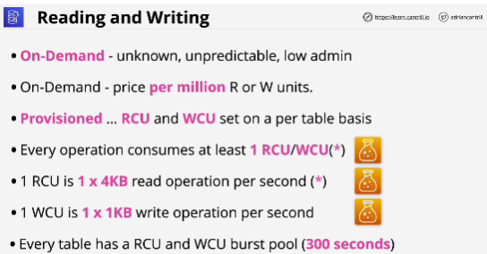
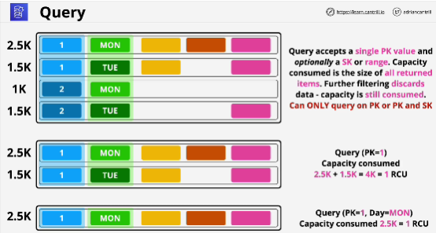
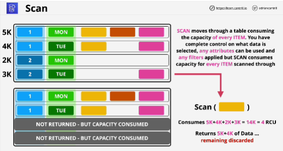

## Query
- When performing **Query** operation you need to start with the **partition key**.

- With any operations on DynamoDB you always have to operate on the entire item.

- You have to query for one particular value of the partition key.

- You are only charged for the capacity of that query operation.

- You can specify particular attributes that you want to return. 

**Query operation can only ever query based on one particular partition key values.**

## Scan
- Move through the table item by item.

- You can specify any attributes that you want to match.

- **It is scanning through the entire table.**

