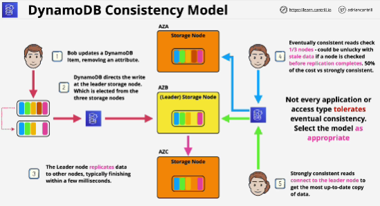
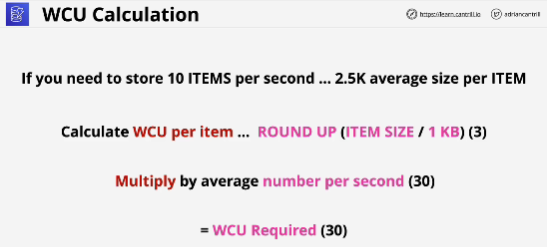
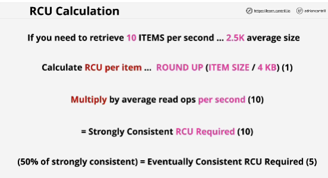

- **Eventual consistency** is easier to implement from an underlying infrastructure perspective, and it scales better.

- **Strong consistency** is esential in some types of applications or some types of operations, it scales less well than eventual consistency.

