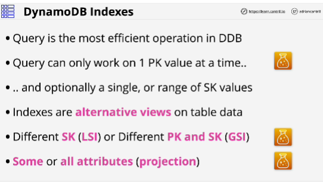
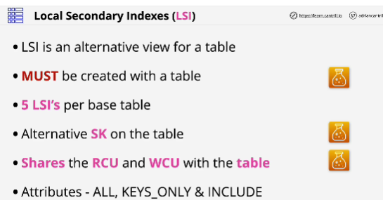
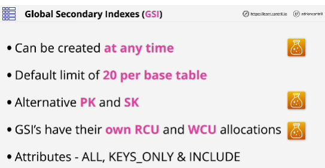
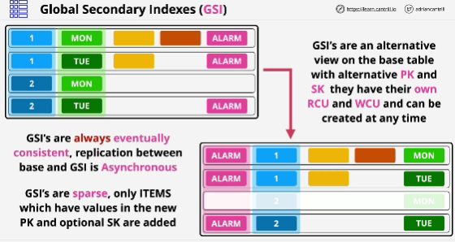
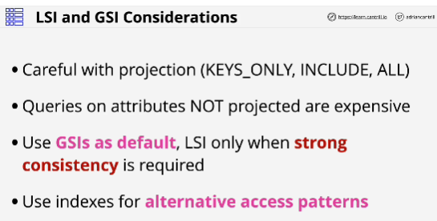

- Indexes are a way to improve the efficiency of data retrieval operations within DynamoDB.

- **Local secondary indexes** allow you to create a view using a different sort key.

- **Global secondary indexes** allow a view with a diferent partition and sort key.

When you creating this two type of indexes you have the ability to choose which attributes from the base table are projected into them.

## Local secondary indexes

- Allow you to create an alternative view on the data that's in a base table by providing an alternative sort key.

They use the same partition key and they can only be created along with the base table. 

- You cannot add local secondary indexes after the base table has been created.

- **Sparse indexes**: only items from the base table which have a value for the attribute that we define as the new sort key are present in the index.

## Global secondary indexes

- Can be created at any time.

- **Indexes are designed when you have data in a base table.**

