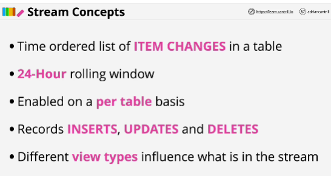
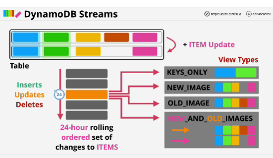
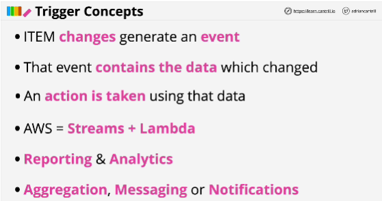
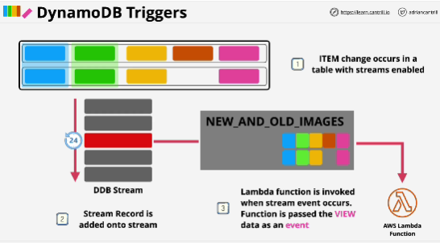

- View setting influences exactly what information is added to the stream every time an item change occurs.

- **KEYS_ONLY**: stream will only record the partition key and optionally any applicable sort key value for the item which has changed.

- **NEW_IMAGE**: stores the entire item with the state as it was after the change.

- **OLD_IMAGE**: if you wanted to know what changed, that way you have a copy of data as it was before the change and you could check the state of the database

- **NEW_AND_OLD_IMAGES**: complete view of change - before and after; you entry in the stream stores both pre-change and the post-change state on that item 

- All of these types of views work as well with inserted or deleted items 

## Trigger concepts

