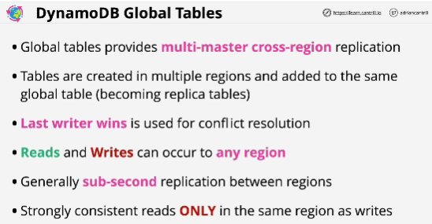
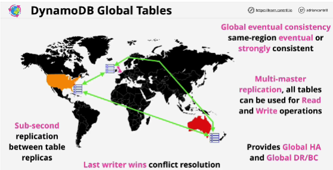

- All tables are the same.

- It's global and allows for read and write replication between all tables that are part of a global table.

- The replication between tables is asynchronous.

- Replication is multi-master: all regions can be used for both read and write operations.

