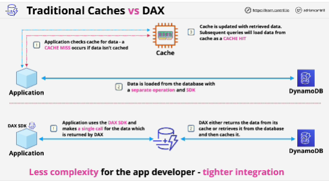
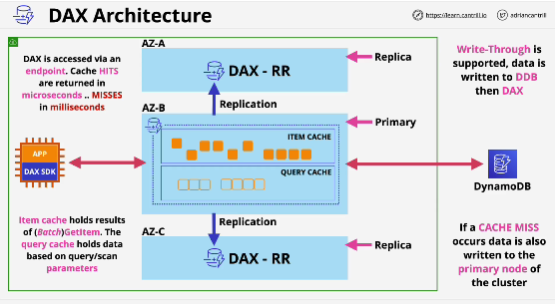
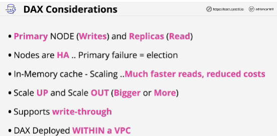

- **DynamoDB Accelerator (DAX)** is an in-memory cache designed specifically for DynamoDB.

- **Write-through caching**: data is written into DAX at the same time as being written into the database.

**Scearios** for use:
- if you find yourself having performance issues during sale periods, or have specific tables or items in a table where there are heavy read workloads against that area of data - DAX

- if you've got workload, type of data layout where a certain type is used more frequently than everything else - DAX

- Low response times - DAX

**Situations where DAX is not ideal**:
- any applications that require strongly consistent reads

- if your application cannot tolerate eventual consistency 

- if you don't have an application that is latency-sensitive, if you don't need these really low response times

- if your application is write-heavy and very infrequently uses read operations

## EXAM

- Talking about a caching requirement with DynamoDB - DAX

