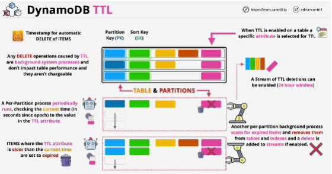

- **Amazon DynamoDB Time to Live (TTL)** allows you to define a per-item timestamp to determine when an item is no longer needed. 

- When you configure TTL on a table, it configures automated processes which run on every partition of that table.

- Delete events are placed into a normal table stream along with any creates or modifies, but in addition, you can create a dedicated stream which is linked to the TTL processes, so you can get a 24-hour rolling window of just those deletes.

- TTL allows you to define a per-item timestamp which determines when an item is no longer needed.

