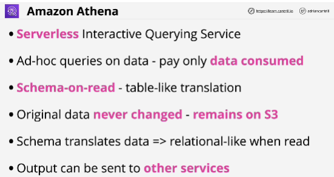
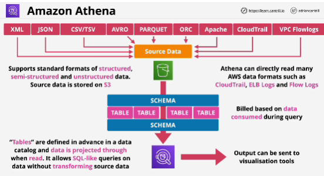
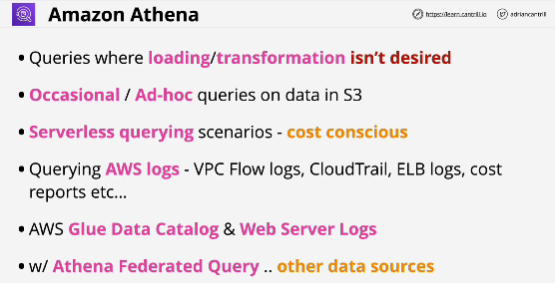

- **Amazon Athena** is serverless querying service which allows for ad-hoc questions where billing is based on the amount of data consumed.

- Athena uses a process called **schema-on-read** (like a window or a lens through you see the data in a certain way but where the original data is unchanged)

- **Athena has no infrastructure.**

- Before run any queries set up a query result location in Amazon S3.

- It can be used to query open data, to query various different types of AWS data, query federated data sources.