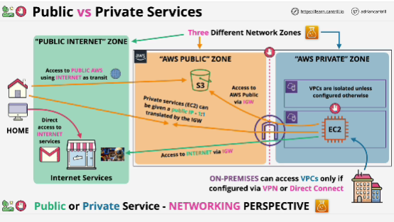

- **Public service** is something which is accessed using public endpoints, such as the simple storage service -  S3.

- A **private AWS service** is something which runs within a VPC, so only things within VPC or what is connected to that VPC, can access the service.

- **AWS public zone** is the networking zone where AWS public services operate from, services with public enpoints such as S3.

