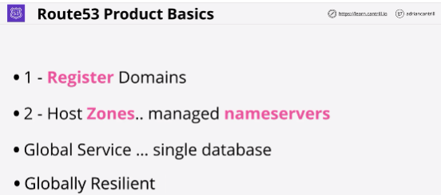
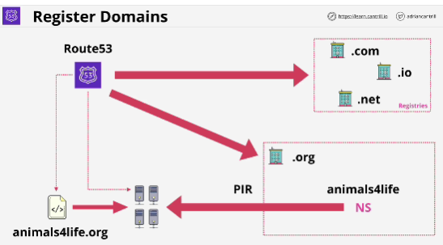

- AWS managed DNS product.

- **Route 53** can tolerate the failure of one or more regions and continue to operate without any problems.

- When a domain is registered, Route 53 checks with the registry for that top level domain if the domain is available.

Then Route 53 creates a zone file for the domain being registered. Zone file is a database which contains all of the DNS information for a particular domain.

Route 53 also  allocates name service for this zone. 

