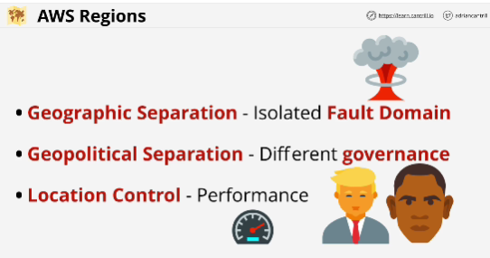

- **Edge locations** are smaller than regions, and they generally only have content distribution services, as well as some types of edge computing.
They are located in many more places than regions.

- **Globally resilient** services: IAM and Route 53

- **Region resilient** services: operate in a single region with one set of data per region. 

- **AZ Resilient** run from a single AZ.