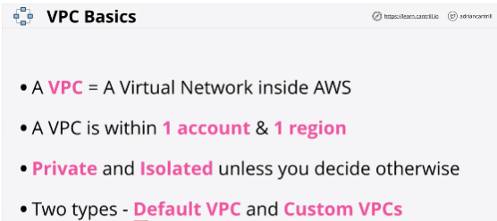
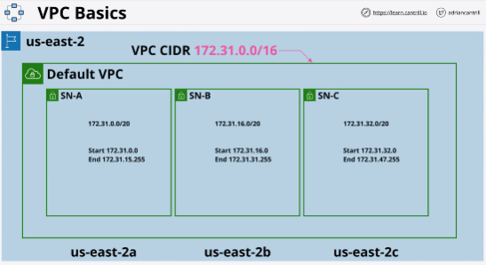
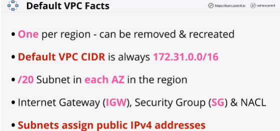

- A **default VPC** is created once per region when an AWS account is first created.

- There can only be one default VPC per region, and they can be deleted and recreated from the console UI .

- VPC is the service you will use when:
    - creating private networks inside AWS that other private services will run from
    - used to connect your AWS private networks to your on-premises network when creating a hybrid environment
    - lets you connect to other cloud platforms when you're creating a multi-cloud deployment

- **Regional service** - regionally resilient

- **Custom VPC** 100% private by default

- **VPC CIDR** defines the start and the end range of IP addreses that the VPC can use.

- **172.31.0.0/16** VPC default CIDR

- The higher that the CIDR range / number is, the smaller the network is.

