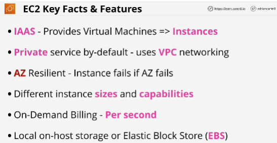
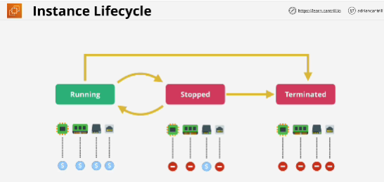
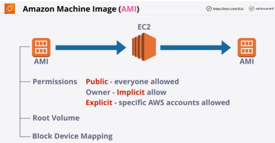
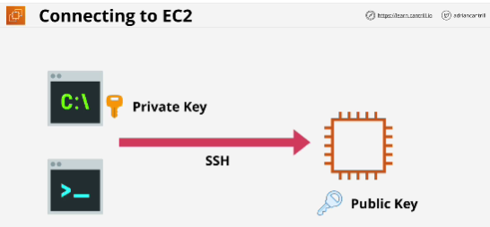

- The **Elastic Compute Cloud** or EC2 is AWS's implement of IAAS - Infrastructure as a service.

- Two popular types of storage:
    - **local host**: EC2 host that the instance runs on
    - **Elastic Block Store (EBS)**: network storage made available to the instance

- **AMI** can be used to create an EC2 instance or AMI can be created from an EC2 instance.

- You can connect to Windows instances using RDP (Remote Desktop Protocol), which runs on port 3389.

- With Linux instances you use the SSH protocol, which runs on port 22.

- Public part of key AWS keep. The private part is how you authenticate to the instance. 

