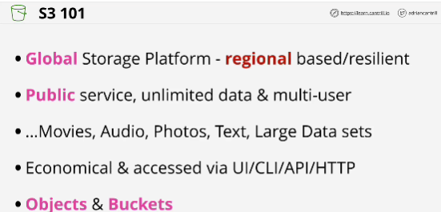
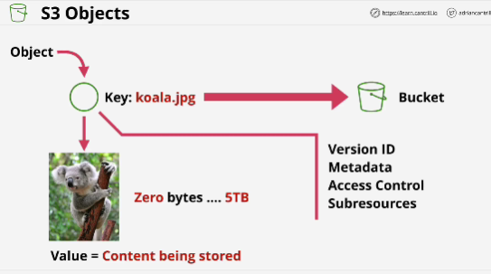
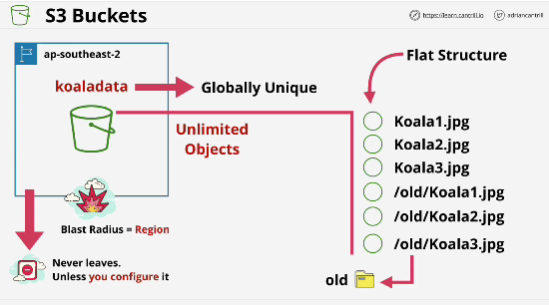
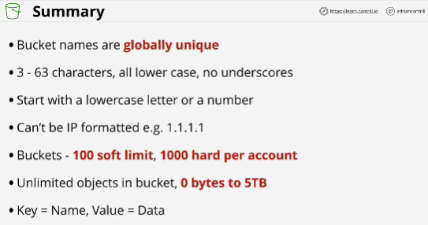
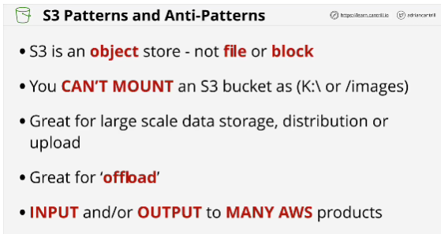

- **Simple Storage Service (S3)** is a core AWS service.

- **Objects** are the data the S3 stores.

- **Buckets** are containers for objects.

- 0 - 5 TB size of object

- Buckets are created in a specific AWS region.

- **Blust Radius**: if a major failure occurs, the effect of that will be contained within the region.

- Bucket name is **globally unique**

- Bucket can hold unlimited number of objects.

- **Block storage** is basically virtual hard disks. EBS: block storage

