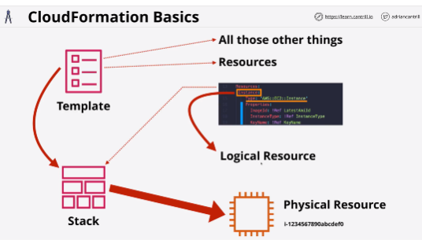

- **CloudFormation** is an Infrastructure as Code (IaC) product in AWS which allows automation infrastructure creation, update and deletion.

- Templates created in YAML or JSON can be used to automate infrastructure operations.

- Templates are used to create stacks, which are used to interact with resources in an AWS account.

- All templates have a **list of resources**, at least one.

The resource section of a template is the only mandatroy part of a CloudFormation template.

- **Text** is a free text field, which lets the author of template add a description. 
You would use this to give some details about what the template does, what resources get changed, the cost of a template.

**Only restriction**: if you gave both decription and an AWSTemplateFormatVersion then the description needs to immediately follow the template format version.

template format version isnt mandatory!

- **Metadata** can control how the different things in the CloudFormation template are presented through the console UI.

- **Parameters** is where you can add fields which prompt the user for more information.

- **Mappings**: optional section, allows you to create lookup tables.

- **Conditions** allows making decisions in the template.

- **Outputs** are the way that once the template is finished, it can present outputs based on what's being created, updated or deleted.

- **Stack** contains all of the logical resources that the template tells it to contain.
Stack is a living and active representation of a template.

- For any logical resources in the stack, CloudFormation makes a corresponding physical resource in your AWS account.

