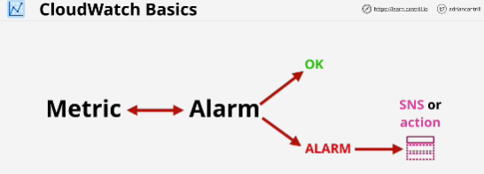

- **CloudWatch** is a core supporting service within AWS which provides metric, log and event management services.

- CloudWatch is a **public service**.

- Based on what data CloudWatch stores, it can be viewed through the console, the CLI, or CloudWatch can use this data and, via alarms, it can take actions such as auto-scaling the number of EC2 instances, or it can send the notification to the simple notification service, which send you an email.

- All AWS data goes into an AWS namespace, which is called AWS/ serviceName.
Namespaces containt related metrics.

- A metric is a collection of related data points in a time ordered structure.

Metric is not for a specific server.

- **Alarms** are created and linked to a specifiy metric.

