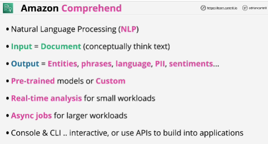

- **Amazon Comprehend** is a natural-language processing (NLP) service that uses machine learning to uncover valuable insights and connections in text.

- You put a document and it develops insights by recognizing the entities, key phrases, language, sentiments, and other common elements of that document.

