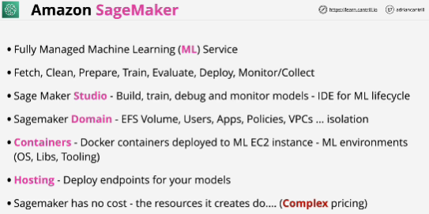

- **Amazon SageMaker** is a fully managed machine learning service. With SageMaker, data scientists and developers can quickly and easily build and train machine learning models, and then directly deploy them into a production-ready hosted environment.

- Helps you with the process of developing and using machine learning models.

- **Sagemaker Domain**: isolation or groupings for a particular project.

- Resource that it creates do have a cost.

