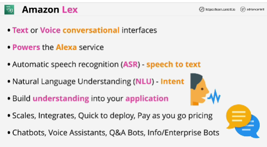
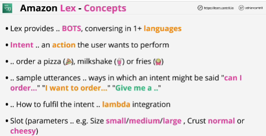

- Allows you to create an interactive chatbots.

- Backend service

- You'll use it to add capabilities to your application.

- Lex is type of product that you're not going to use directly via the console.  
It's going to be something that you're going to be architect or develop into your applications. 

