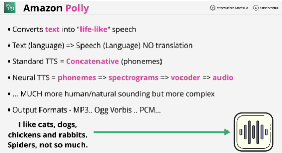
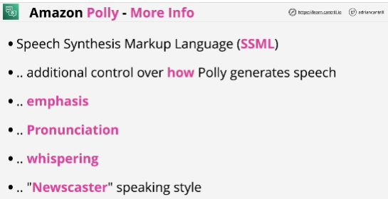

- **Amazon Polly** is a service that turns text into lifelike speech, allowing you to create applications that talk, and build entirely new categories of speech-enabled products.

- Polly performs no translation.

- Polly can be integrated with other AWS services where you need speech to be generated on text, or you can integrate Polly with your own applications using the APIs.

