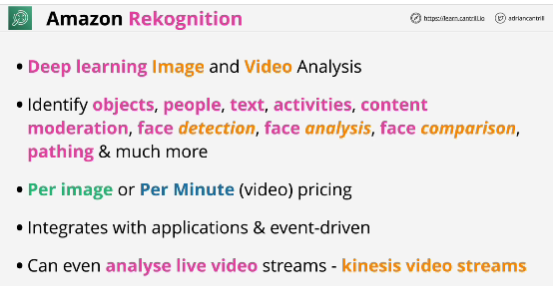
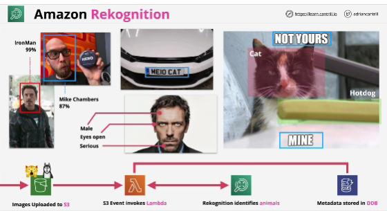

- **Amazon Rekognition** offers pre-trained and customizable computer vision (CV) capabilities to extract information and insights from your images and videos.

- Rekognition is a deep learning based image and video analysis product.

- Deep learning is a subset of machine learning. 

- General analysis performing on images or videos for content, emotions, text, activites - Rekognition

