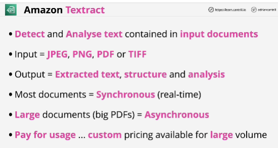
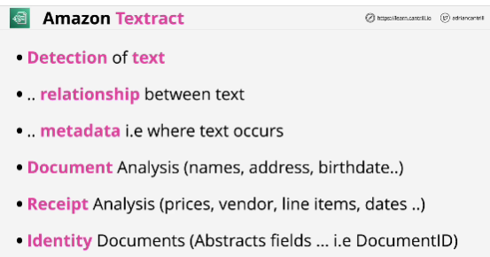

- **Amazon Textract** is a machine learning (ML) service that automatically extracts text, handwriting, and data from scanned documents.
- It goes beyond simple optical character recognition (OCR) to identify, understand, and extract data from forms and tables

- Capable of using for the console UI, or from APIs.

