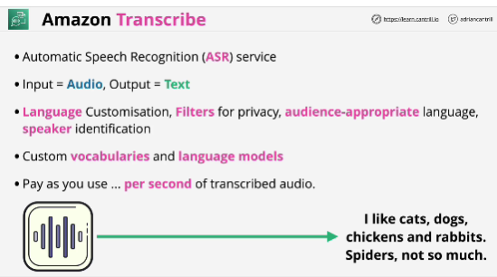
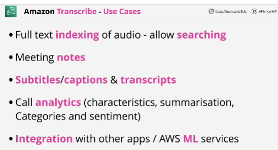

- **Amazon Transcribe** is an automatic speech recognition service that uses machine learning models to convert audio to text. You can use Amazon Transcribe as a standalone transcription service or to add speech-to-text capabilities to any application.

