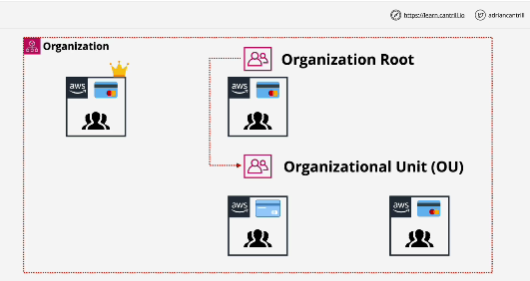

- **AWS Organization** is a product which allows larger businesses to manage multiple AWS accounts in a cost-effective way with little to no management overhead.

- Standard AWS account is an AWS account which is not within an organization. With standard AWS account you create an AWS organization. 

- Standard AWS account that you created the organizattion with then becomes the **Management/Master Account** for the organization.

- Using Management Account you can invite other exist standard AWS accounts into the organization.

- When standard AWS account join an AWS Organization, then they change from being Standard Accounts to being **Member Accounts** of that organization.

- Organizations have one and only one Management/Master account and they have zero or more Member Accounts.

- You can create a structure of AWS accounts within an organization.

- Structure within AWS Organizations is hierarchical, so it's an inverted tree.

At the top of this tree is the root container of the organization. This is just a container for AWS accounts which exists at the top of this organizational structure.

- The Member Accounts instead pass their billing through to the Management Account of the organization.

- **Payer Account** is AWS account that contains the payment method for the organization

- Using consolidated billing within an AWS organization means that you get a single monthly bill which is contained within the Management Account. 

- One bil contains all of the billable usage of all of the accounts within the AWS organization.

- AWS organization also feature a service called **Service Control Policies** SCPs, and this lets you actually restrict what AWS accounts within the organization can do.

- With Organizations, you don't need to have IAM Users inside every single AWS account.

- **Role switch** 