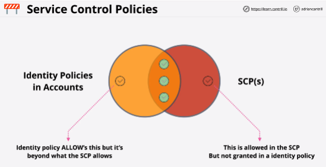

- a feature of AWS Organizations which allow restrictions to be placed on MEMBER accounts in the form of boundaries.

- It's a policy document, a JSON document.

- Service control policies can be attached to the organization as a whole by attaching them to the root container, or they can be attached to one or more organizational units.

They can even be attached to individual AWS accounts.

- Service control policies inherit down the organization tree.
If they're attached to the organization as a whole, so the root container of the organization, then they affect all of the accounts inside the organization.

- Even if management account has service policies attached, either directly via an organizational unit, or on the root container of the organization itself, then the management account is never affected by service control polices.

- Member accounts can be effected, the MANAGEMENT account cannot.

- You can never restrict Account Root user.

- Service control policies are just a boundary. They define the limit of what is and isn't allowed within the account, but they don't grant permissions.

- Default is DENY list 
AWS apply a default policy, which is called full AWS access.

This policy means that in the default implementation, service control policies have no effect since nothing is restricted.

- Service control policies don't grant permissions, but SCPs are enabled, there is an implicit default deny, just like IAM policies.

- To implement allow lists, it's a two-part architecture. 
One part of it is to remove the AWS full access policy. This means that only the implicit default deny is in place and active and then you would need to add any services which you want to allow into a new policy.

- Only permissions which are allowed within identity policies in the account and are allowed by a service control policy are actually active.

