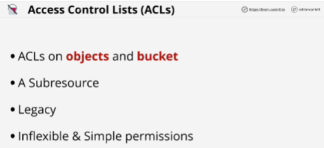
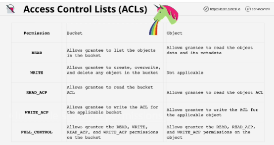
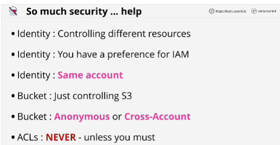

- **S3** is private by default.

- The only identity which has any initial access to an S3 bucket is the account root user off the account which own that bucket, so the account which created it.

- With identity policies, you're controlling what that identity can access. 

With resource policies, you're controlling who can access that resource.

You can only attach identity policies to identities in your own account.

- Identity policies by design have to be attached to a valid identity in AWS.

- The **principal part** of a resource policy defines which principals are affected by the policy.

- Bucket policies can be used to control who can access objects, even allowing conditions which block specific IP addresses.

- Resource policy is associated with a resource. 
A bucket policy, which is a type of resource policy, is logically associated with a bucket which is a type of resource.

- There can only be **one bucket policy on a bucket** but it can have multiple statements.

- **Access Control Lists (ACLs)** are ways to apply security to objects or buckets.
AWS don't recommend them to use.

They can't have conditions like bucket policies.

- IAM is the only single place in AWS you can control permissions for everything.

