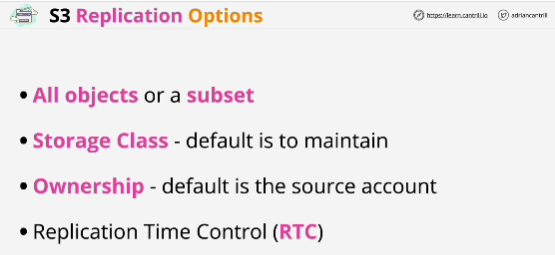

- **Cross-Region Replication (CRR)** allows the replication of objects from a source bucket to one or more destination buckets in different AWS regions.

- **Same-Region Replication (SRR)** is the same process but where both the source and destination buckets are in the same AWS region.

- The replication configuration configures S3 to replicate from source bucket to a destination bucket.

The role is configured to allow the S3 service to assume and that's defined in its trust policy.

- The role's permissions policy gives permission to read objects on the source bucket and permissions to replicate those objects to the destination bucket.

- Inside one account both S3 buckets are owned by the same AWS account so they both trust that same AWS account that they're in. Both trust IAM as a service which means that they both trust the IAM role.
For the same account that means that the IAM role automatically has access to the source and the destination buckets as long as the role's permission policy grants that access.

- If you're configuring replication between different AWS accounts though that's not enough.
The destination bucket, because it's in a different AWS account doesn't trust the source account or the role that's used to replicate the bucket contents.

Role that's configured to perform the replication isn't by default trusted by the destination account because it's a seperate AWS account.

Requirement: add a bucket policy on the destination bucket which allows the role in the source account to replicate objects into it.

- Default it to replicate an entire source bucket to a destination bucket, so all objects, all prefixes and all tags.

- **Storage class**: default is to use same storage class on the destination as is used on the source, but you can override that in the replication configuration.

- **Ownership**: default is that they will be owned by the same account as the source bucket.

If the buckets are in different accounts, then by default the objects inside the destination bucket will be owned by the same bucket account.

- **RTC** adds a guaranteed 15 minute replication SLA onto this process.

- If any changes are made in the source bucket by lifecycle management, they will not be replicated to the destination bucket so only user events are replicated and in addition to that it can't replicate any objects inside a bucket that are using the Glacier or Glacier deep archive storage classes.

- Cross-Region Replication (CRR) is the process used when Source and Destination are in different AWS regions

Same-Region Replication (SRR) is used when the buckets are in the same region.