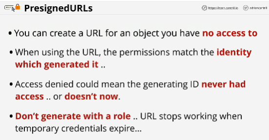

- Way that you can give another person or application access to an object inside an S3 bucket using your credentials in a safe and secure way.

- When PreSigned URL is used the holder of that URL is actually interacting with S3 as the person who generated it.

- With PreSigned URL we can keep the bucket private.

- PreSigned URL are often used when you offload media into S3, or as a part of serverless architectures, where access to a private S3 bucket needs to be controlled and you don't want to run thick application servers to broke that access.

- The only requirement for generating a PreSigned URL is that you specify a particular object and an expiry data and time.

- When you're using a URL to access an object, it matches the current permissions of the identity that generated that URL.

