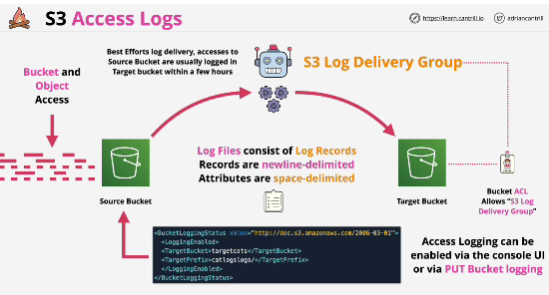

- Server **access logging** provides detailed records for the requests that are made to a bucket. 

- The **source bucket** is what we want to gain visibility of.

- The **tarhet bucket** is where we want the logging to go.

- Logging is managed by a system known as the S3 delivery group, which reads the logging configuration which you set on the source bucket.

- You also need to give the log delivery group access to the target bucket.

- **Single target bucket** can be used for many source buckets and you can seperate these easily using prefixes in the target bucket.
Configured within the logging configuration that's set on the source buket.

- **Access logging** provides detailed information about the requests which are made to a source bucket and they're useful for many different applications, most commonly security functions and any access audits.

