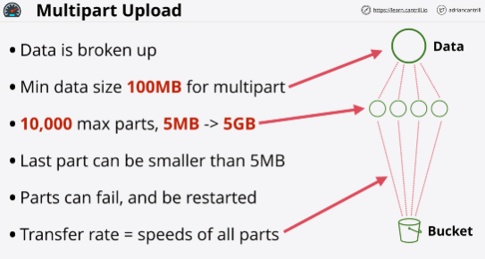

- If you utilize a single PUT upload, then you're limited to 5 GB of data as a maximum.

- **Multipart upload** improves the speed and reliability of uploads to S3.

- Each individual part is treated as its own isolated upload.

- The **Transfer rate** of the whole upload is the sum of all of the individuals parts.

- Using public internet for data transit is never an optimal way to get data from source to destination.

- **Transfer acceleration** uses the network of AWS edge locations which are located in lots of convenient locations globally.

- An S3 bucket needs to be enabled for transfer acceleration.

The default is that is **switched off**

Restrictions for enabling it:
- bucket name cannot contain periods 
- it needs to be DNS compatible in its naming

Once enabled, data is going to closest best performing AWS edge location.

- Benefits achieved by using transfer acceleration improve the larger the distance between the upload location and the location of the S3 bucket.

- The worse initial connection the better the benefit by using transfer acceleration.

