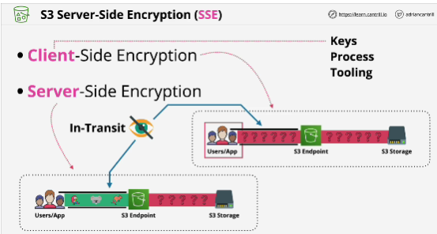
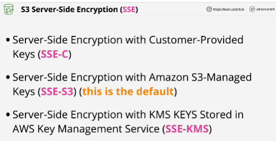
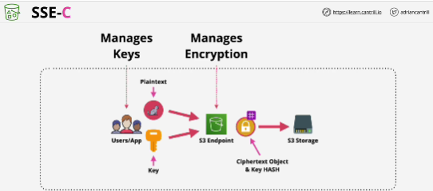

- **Buckets aren't encrypted, objects are.**

- Both of these methods use encryption in transit between the user side and S3. This is an **encrypted tunnel** which means that you can't see the raw data inside the tunnel - it's encrypted

- With **client-side encryption**, the objects being uploaded are encrypted by the client before they ever leave.
Data is in ciphertext the entire time.
AWS would have no opportunity to see the data in its plain text form.

- With **server-side encryption**: even though the data is encrypted in transit using HTTPS, the objects themselves aren't initially encrypted meaning that inside the tunnel the data is in its original form.

- With **client-side encryption** everything is yours to control.
You are responsible for recording which key is used for which object, and you perform the encryption process before it's uploaded to S3. 

- With **server-side encryption** you allow S3 to handle some or all of that process and this means there are parts that you need to trust S3 with.

- **SSE is mandatory on objects within S3 buckets.**

## SSE-C

- S3 are handling the cryptographic operations.

- You provide plaintext object and encryption key.

- Object and one-way hash are stored on disk pesistently.

- To decrypt, you need to provide S3 with the request and the key used to encrypt the object.

- **You would choose client-side encryption when you need to manage the keys and also the encryption and decryption processes and you might do this if you never want AWS to have the ability to see your plain text data.

## SSE-S3 (AES256)

- AWS handles both the encryption and decryption processes as well as the key generation and management.

- You have very little control over the keys used. 

- Good default type of encryption.

- Problems:
    - if you're in an environment which is strongly regulated, where you need to control the keys used and control access to the keys, this isn't suitable
    - if you need control rotation of keys
    - if you need role seperation

## SEE-KMS

- When S3 wantts to encrypt an object using SEE-KMS it has to liaise with KMS and request a new data encryption key to be generated using the chosed KMS key.

- Can only encrrypt objects up to 4 KB in size.

- Benefit: role seperation

- To decrypt an object encrypted using SSE-KMS you need access to the KMS key which was originally used. 

- If you don't have access to KMS, you can't decrypt the data encryption key so you can't decrypt the object and so it follows you can't access the object.

