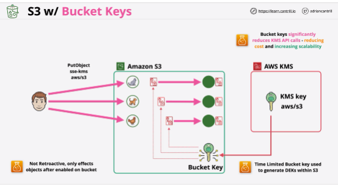

- Amazon S3 **Bucket Keys** reduce the cost of Amazon S3 server-side encryption using AWS Key Management Service (SSE-KMS).

- It only affects objects and the object encryption process after it's enabled on a bucket.

- Works with the same region replication and cross region application.

- **When S3 replicates an encrypted object, it generally perserves the encryption settings of that encrypted object.**

