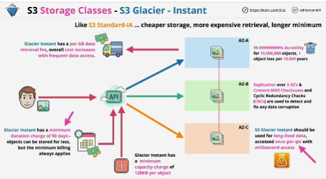

## S3 Glacier-Instant

- Minimum storage duration charge of 90 days vs 30 days of Standard IA.

## S3 Glacier-Flexible

- "Cold objects": they aren't warm, they aren't ready for use - they aren't immediaetely available.

- They can't be made public. 

- **Has a first byte latency of minutes or hours**

- Limits: 40kb minimum billable size and 90-day minimum billable duration.

- Archival data where frequent or real-time access isn't needed: yearly access

## S3 Glacier Deep Archive

- Data in "frozen" state.

- Limits: 40kb minimum billable size and 180-day minimum billable duration.

- Objects cannot be made publicly accessible.

## S3 Intelligent-Tiering

- Storage class which contains five different storage tiers.

- You don't have to worry about moving objects between tiers.

- If the object isn't accessed for 30 days, then it would be moved automatically into the infrequent tier where it would stay while stored at a lower rate.

- Designed for long-lived data where the usage is changing or unknown.

- Intelligent-Tiering is only good if you have data where the pattern changes or you don't know it.

