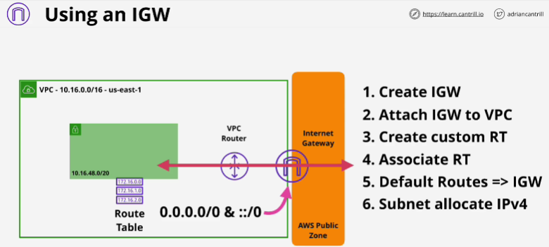

Internet gateway - how we can configure VPC so data can exit to and enter the AWS public zone on a public internet.

# VPC Router
- The router has a network interface in every subnet VPC (**the network + 1** address of the subnet)
- VPC routes traffic between subnets in that VPC
- Contolled by 'route tables' each subnet has one. Toute table that's associated with a subnet defines what the VPC router will do when data leaves that subnet.
- VPC is created with **main route table**
- If you don't explicitly associate a custom route table with a sub-net, it uses the main route table of the VPC.
- A subnet can only have one route table associated with it at any one time, but a route table can be associated with many subnets.

# Route Tables
- Route table is just a list of routes.
- VPC router looks at the destination address of all packets leaving subnet and when it has that address it looks at the route table and it identifies all the routes which match that destination address. 
- **Destination fields** determines what destination the route matches. (**could match exactly one specific IP address**)
- **The higher the prefix value, the more specific the route is and the higher priority that route has**
- **Target field** (will either point at an AWS gateway or it will stay - local local means that the destination is in the VPC itself))
- All route tables have at least one route, the local route. 
- Local routes can **never** be updated, the local routes always take priority.

# Internet gateway
- One of the most important add-on features available within a VPC. 
- **Region resilient** gateway attached to a VPC
- One internet gateway will cover all of the availability zones in the region which the VPC is using.
- Relationship between VPC and Gateway -> 1:1 
- IG runs from the border of the VPC and the AWS public zone.
- Managed - AWS handles performance

# Using an IGW 
- When all of these 6 steps are done, subnet is clasified as being a public subnet

# IPv4 Addresses with a IGW
- Public IPv4 addresses never touch the actual services inside a VPC. 
- When you allocate a public IPv4 address, a record is created which the internet gateway maintains. It links instance's private IP to its allocated public IP.
Instance itself is not configured with that IP. 
- For IPv4 it is not configured in the OS with the public IP address. 

# Bastion Host/ Jumpbox
- An instance in a public subnet inside a VPC. 
- They're used to allow incoming managment connection. All incoming managment connections arrive at a bastion host or a jumpbox, and then once connected, you can then go on to access internal-only VPC resources. 
- Used either as a managment point or as an entry point for private-only VPCs.
- Can configure these bastion hosts or jumpboxes to only accept connections from certain IP addresses to authenticate eith SSH, or to integrate with on-premises identity servers. 
- They are generally the only entry point to highly secure VPC.

# EXAM
**not** assigning the public IPv4 address of an EC2 instance directly to the OS. It has no knowledge of public address. 
- Configuring an EC2 instance appropriately using IPv4 means putting the private IP address only. 
- The public address never touches the instance. 
- For IPv6 all addresses that AWS uses are natively, publicly routeable.  

