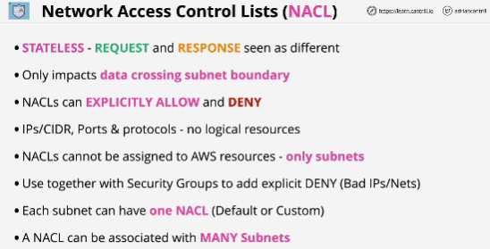

A traditional firewall available within AWS VPCs.

**Connections between things within that subnet are not affected by network ACLs.**

Each network ACL contains two sets of rules:
1. **Inbound rules** only affect data entering the subnet 
2. **Outbound rules** affect data leaving the subnet
These rules are focused only on the direction of traffic, not whether it's request or response.

NACLs are stateless, they don't know if traffic is request or response. 

NACLs offer both explicit allows and explicit denies. 

Rules are processed in order. 
1. NACL determines if the inbound or outbound rules apply, then it starts from the lowest rule number. 
It evaluates traffic against each individual rule until it fins a match. 
2. Traffic is either allowed or denied based on that rule and then processing stops. If you have a deny rule and allow rule which match the same traffic, but if deny rule comes first, then the allow rule might never be processed. 
3. As a catch-all showed by the asterisk in the rule number, and this is an implicit deny. If nothing else matches then traffic will be denied. 

When VPC is created, it's created with a **default NACL** and this contains inbound and outbound rule sets which have the default implicit deny, but also a catch-all allow, and this means that the net effect is that all trafic is allowed. 

NACLs have no effect within a VPC default. They aren't used.

# Custom NACL
Created for a specific VPC, and initially they're associated with no subnets. They have one rule on inbound and outbound - default deny. 

If you associate custom network ACL with any subnets, **all traffic will be denied**.

