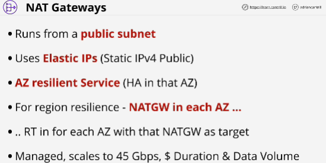
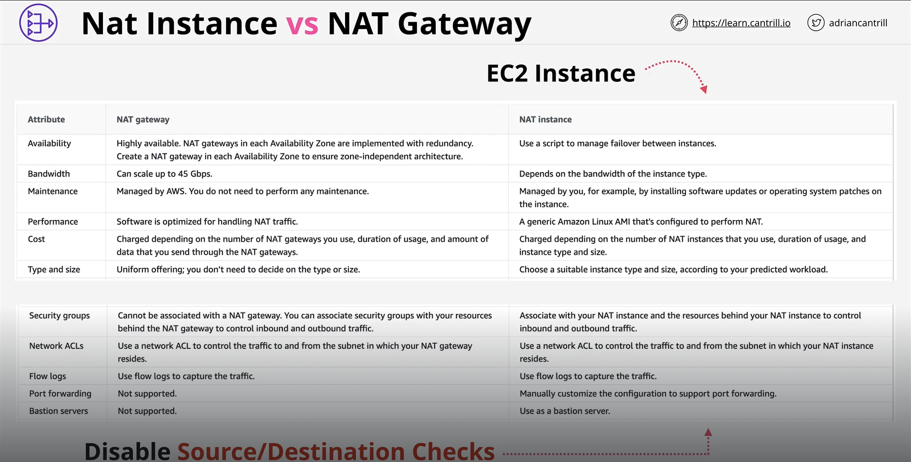
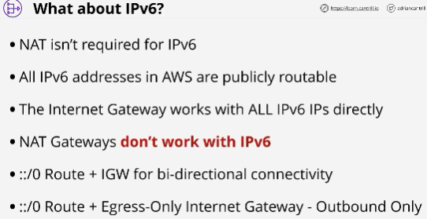

Process of giving a private resource outgoing only access to the internet. 

NAT gateway is the AWS implementation that's available within a VPC. 

# Network Address Translation (NAT)
Set of different processes which can adjust IP packets by changing their source or destination IP addresses. 

**IP masquerading** hides a whole private CIDR block behind a single public IP.

NAT is many private IP addresses to one single IP. 

Gives Private CIDR range outgoing internet access.

Devices that are using NAT can initiate outgoing connections to internet or AWS public space services. Those connections can receive response data but you cannot initiate connections from the public internet to these private IP addresses when NAT is used, it doesn't work that way.

Two ways to provide NAT services:
1. Use EC2 instance configured to provide NAT.
2. Managed service the NAT gateway which you can provision into VPC to provide same functionality.

NAT gateway maintain something called **translation table** (IP records involved, the source and destination, the port numbers)

NAT has default route which points to internet gateway. 

NAT gateway job is to allow multiple private IP addresses to masquerade behind the IP address that it has. 

# EXAM
One NAT gateway is enough, that a NAT gateway is truly regionally resilient. **false**
**true** NAT gateway is highly available in the availability zone that it's in. 

Internet gateway - regionaly resilient

*Using NAT instance, by default, EC2 filters all traffic that it sends or receives.*

# NAT instance vs NAT Gateway
Both need a public IP address, need to run in a public subnet, both need a functional internet gateway.

Recommended to use NAT gateway as instance, not EC2.

## Using NAT gateways for this scenario:
- Availability
- Bandwith
- Low level of maintenance
- High performance
- Not free eligible
NAT gateway is **managed service** (cannot be used as a bastion host, cannot do port-forwarding because you cannot connect to its OS)
*not support security groups* can only use NACLs with NAT gateways

## NAT instance is a signle EC2 instance running inside an availability zone
It will fail if the EC2 hardware fails.

NAT gateway benefits over a NAT instance: inside one AZ is highly available (it can automatically recover) 

For maximum availability, a NAT gateway in every AZ you use. 

## Using NAT instance (EC2) for this scenario:
- COST
- VPC that you're deploying NAT services into is just a test VPC
- Low volume
- Port forwarding

- NAT is not required for IPv6
- Main focus of NAT is to allow private IPv4 address to be used to connectt in an outgoing only way to the AWS public zone and public internet. 
- **NAT Gateways don't work with IPv6**

**Egress Only Internet Gateway** works only with IPv6

