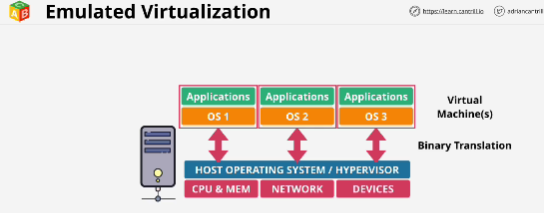
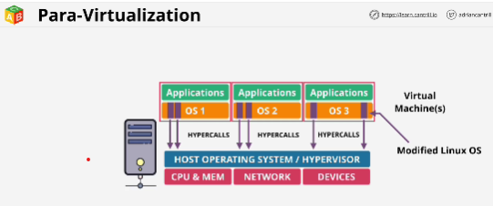
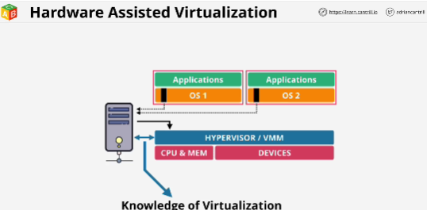
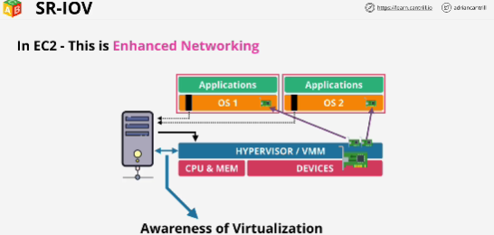

- EC2 prrovides virtualization as a service (IaaS)

## Virtualization is the process of running more than one OS on a piece of physical hardware or server.

**Kernel** is only part of OS that's abale to directly interact with the hardware. 

Virtualization had to be done in software in one of the two ways:
1. **Emulated Virtualization** (Software Virtualization) - a host OS still run on the hardware and it included additional capability known as a hypervisor. 
- Guset OS still believed that they were running on real hardware. 
- Hypervisor performs a process known as Binary Translation (any privileged operations which the guests attempt to make they're intercepted and translated on the fly in software by the hypervisor) - really slow

2. **Paravirtualization** 
- The guest OS are still running in the same virtual machine containers with virtual resources allocated to them. 
- Paravirtualization only works on a small subset of OS (OS which can be modified)
- There are areas of guest OS which attempt to make privileged calls. They're modified to make them user calls, but instead of directly calling on the hardware, that calls to the hypervisor, called **hyper calls**
- Source code of OS is modified to call the hypervisor rather than the hardware.

## Hardware Assisted Virtualization
- Physical hardware started to become virtualization aware. 
- CPU knows that virualization exists. (when guest OS attempt to run any privileged instructions they're trapped by the CPU, which knows to expect them from guest OS)

## SR-IOV (Single route IO virtualization)
- Allows a network card or any other add-on card to present itself not as one single card, but almost as several mini cards.
- In EC2 this feature is called **Enhanced Networking** (network performance is massively improved - lower latency)

