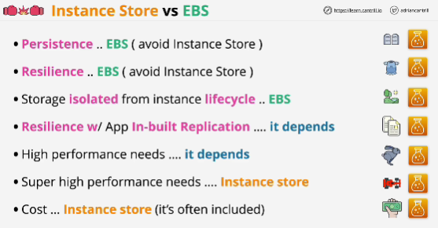
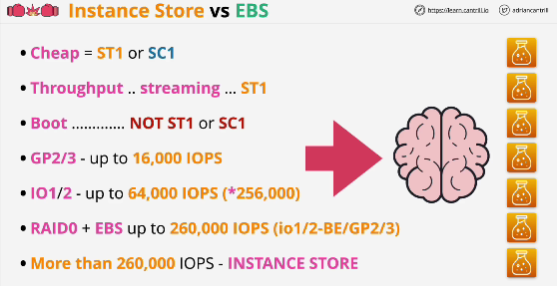

# EBS

**Default rule**: if you need persistent storage then you should default to EBS
**Resilient storage**
**Storage isolated**

# Depends
**Resilience w**/ App **In-built Replication**
Higher performance needs

# Instance store
Super high performance needs
Cost

- Cost efficacy: EBS -> ST1 or SC1 (they're cheaper, mechanical storage)
- Throughput or streaming: ST1 if question mentions boot volumes which exludes both of them (ST1 or SC1)
- Key performance volumes: GP2/3 (maximum performance per volume is 16 000 IOPS)
- If you need between 16 000 IOPS and 64 000 IOPS on a volume: IO1/2
*High levels of performance will only be possible if you're using larger instance types*

- Take lots of individual EBS volumes, and you can create a RAID 0 set from those EBS volumes. 
- More than 260 000 IOPS: instance store

