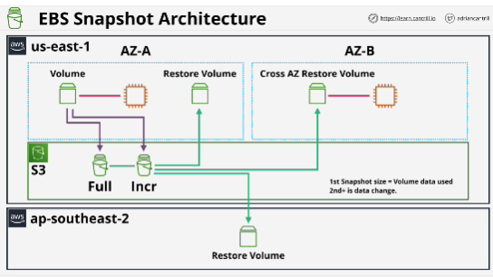
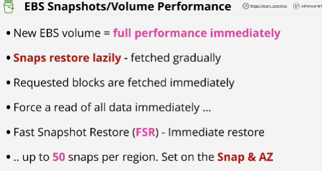
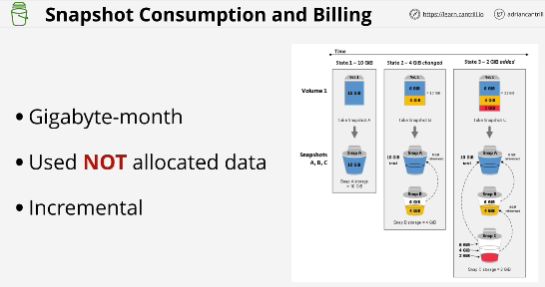

**Snapshots** are backups of EBS volumes, which is stored on S3.
- AZ resilient
- Data that snapshots store become region resilient.
- Incremental in nature:
    - first snapshot taken of a volume is a full copy of all of this data on that volume
    - future snaps are **incremental**: only can store the difference between the previous snapshot and the state of the volume when the snapshot is taken (store changes since the last snapshot)
Incremental references the initial snapshot for any data that isn't changed. 

If you lost *incremental backup* then no furher backups between that point, and when you next took the full backup would work. (don't need to worry about this when it comes to EBS volume)

- When creating EBS volumes you can create:
    - blank volume
    - volume based on snapshots (offer a way to clone a volume) S3 is regional service it means that when you create volume from a snapshot it can be in a different availability zone from the original (snapshots can be used to move EBS volumes between AZs)
- Snapshots can be copied between AWS regions (snapshots can be used for global DR processes or as a migration tool to migrate the data on volumes between regions)

Features of Snapshots:
- Efficient way to backup EBS volumes to S3 (protect data on those volumes against avvailability zone issues or local storage system failure in that AZ)
- Can be used to migrate the data that's on EBS volumes between AZs using S3 as an intermediary.

#EXAM
- When you create a new EBS volume without using a snapshot, the performance is available immediately.
- If you restore volume from a snapshot, it does the restore lazily (if you restore volume right now, then starting right now, over time, it will transfer the data from the snapshot on S3 to the new volume in the background)
- If you attempt to read data, which hasn't been restored yet, it will immediately pull it from S3 (lower levels of performance then reading from EBS directly)
- Force a read of every block of the volume: this is done in OS (tools DD on Linux)
- **Fast snapshot restore (FSR)** makes instantly restore -> up to 50 snaps per region (cost extra)

- EBS doesn't charge for unused areas in volumes when performing snapshots.

