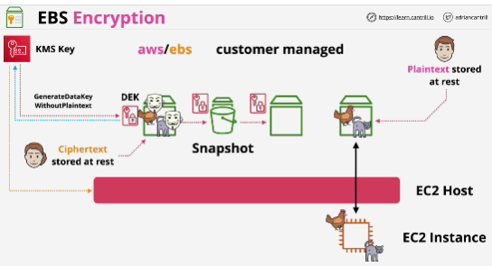
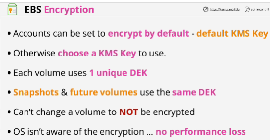

Default - no encription is applied on EBS.

When you create encrypted EBS volume initially, EBS uses KMS and a KMS key which can either be the EBS default AWS managed key.

**Data encryption key** - DEK: occurs with generate data key without plain text API call. (you get the encrypted DEK and this is stored with the volume on the raw storage)
It can only be encrypted using KMS

Data only exists in an unecrypted form inside the memory of the EC2 host.

When EC2 instance moves from one host to another, the decrypted key is discarded, leaving only the encrypted version with the disc. 
For that instance to use the volume again, the encrypted data encryption key needs to be decrypted and loaded into another EC2 host.

If a **snapshot** is made of an encrypted volume, the same data encryptio key is used for that snapshot, meaning the snapshot is also encrypted. 
Any volumes created from that snapshot are themselves also encrypted using the same data encryption key and so they're also encrypted. 

## EXAM
- AWS accounts can be configured to encrypt EBS volumes by default. 
- You can set the default KMS key to use for this encryption or you can choose a KMS key to use manually each and every time.
- KMS key isn't used to directly encrypt or decrypt volumes, instead it's used to generate a per volume unique data encryption key. 
- Every single time you create a brand new volume from scratch, it uses a unique data encryption key. That DEK is used for that one volume and any snapshot you take from that volume which are encrypted and any future volumes created from that snapshot. 
- If you take a snapshot of an existing encrypted volume, it uses the same data encryption key.
- If you create any further EBS volumes from that snapshot, it also uses the same DEK.
- **NO** way to move encryption from a volume or a snapshot, once it's encrypted, it's encrypted.
- The OS itself isn't aware of any encryption. OS just sees plain text.
- Encryption is happening between the EC2 host and the volume. It's encrypted using AES-256.
- Software disc encryption: OS does the encryption and stores the keys. 

