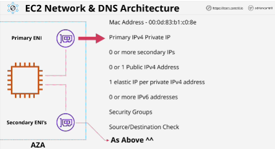
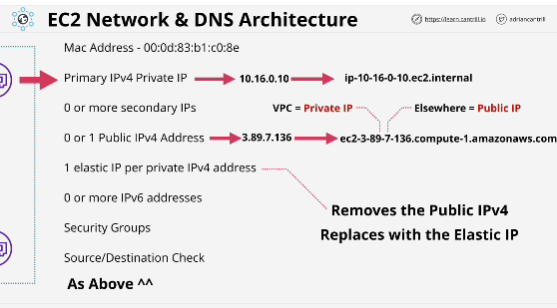
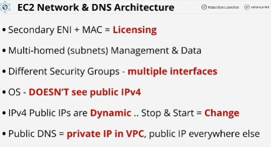

**ENI** Elastic Network Interface

Every EC2 instance have at least one ENI which is primary interface or primary ENI.

Optionally, you can attach one or more secondary ENI, which can be in seperate subnets, but everything needs to be within the same AZ. 

Network interfaces have a:
- MAC address - Hardware address of the interface and it's visible inside the OS.
- Primary IPv4 Private IP from the range of the subnet that the interface is created in. 
- Can enable or disable the **source or destination check**: if traffic is on interface, it's going to be discarded if it's not from one of the IP addresses on the interfaces as a source or destined to one of the IP addresses on the interface as a destination. **This check needs to be switched off for an EC2 instance to work as a NAT instance.**

Elastic IP addresses are public IPv4 adresses -> you can have one public elastic IP address per private IP address on one interface, 0 or more IPv6 addresses, security groups (applied to network interfaces, attached to intefaces)

The capabilities of the secondary interfaces are the same as the primary except that you can detach secondary interfaces and move them to other EC2 instances.  

Elastic IP addresses are allocated to AWS account. 
When allocating Elastic IP address you can:
- associate the elastic IP with a private IP either on the primary interface or a secondary interface 
- if you associate with the primary interface, normal (non elastic IPv4) is removed and the elastic IP becomes the instances new public IPv4 address. 
- if you remove elastic IP address it will gain a new public IPv4 address. 
- no way to back to **original dynamic IPv4 address**
- if you remove the elastic IP, it gets **new one** but it's completely different

- Private DNS name can be used for internal communications **only inside the VPC**.
- Primary IPv4 address is static, it doesn't change for the lifetime of the instance. (allocated a public DNS name)
- Public IP is dynamic, it will change if you stop end start instance. 
- If you restart instance, that will not change IPv4 address (allocated a public DNS name)

## EXAM
- If you provision a secondary elastic network interdace on an instance, and use secondary network interfaces, MAC address for licesing, that means that you can detach secondary interface and attach it to a new instance, and move that licesing between EC2 instances. 
- Multiple interfaces can be used for multi-homed systems.
- Security groups attached to interfaces.
- OS **never sees IPv4 public address** (This is provided by a process called NAT which is performed by the internet gateway)
- **never configure a network interface inside an operating system with a public IPv4 address inside AWS**
- To avoid changing IPv4 Public after stopping instance, you need to allocate and assign an elastic IP address. 
- The public DNS which is given to the instance for the public IPv4 address, will resolve to the primary private IPv4 address from within public VPC. If you've got instance to instance communication using this address inside the VPC, it never leaves the VPC. It doesn't have to go out to the internet gateway and then back again, when you're communicating between two EC2 instance using this public DNS.
- Inside VPC, the public DNS resolves to the private IP. 
- Outside the VPC, it will resolve to the public IP. 

