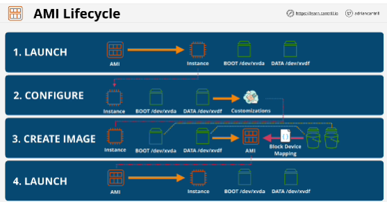

- AMI's can be used to **launch EC2** instance
- AWS or Community Provided
- Marketplace (can include **commercial software**)
- AMI's are **regional**, each AMI has unique **ID**
- AMI region can only be used in the region that it's in 
- AMI controls permission (Public, Account, Specific Accounts)
- You can create an AMI from an existing EC2 instance to capture the current configuration of that instance

## AMI lifecycle
1. LAUNCH
2. CONFIGURE
3. CREATE IMAGE: when you create an AMI for any EBS volumes which are attached to that EC2 instance, we have EBS snapshots created from those volumes 
*Block device mapping*: table of data (it links the snapshots IDs)
4. LAUNCH

AMI itself does not contain any real data volume, an AMI is container

## EXAM
- AMI = One region, only works in that one region
- **AMI Baking** is the concept of taking an EC2 instance, installing all of the software, doing all the configuration changes, and then baking all of that into an AMI.
- AMI **cannot be edited**
- AMIs can be copied between AWS regions. 
- Permissions: default - your account
- Billing: AMI contain EBS snapshots (billed for the capacity used by snapshots)

1. Step of creating AMI: snapshots of any of the EBS volumes attached to that EC2 instance