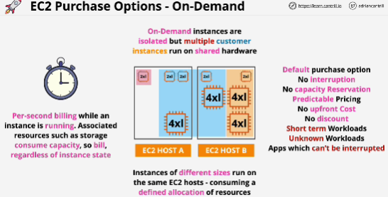
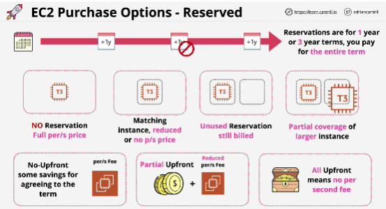
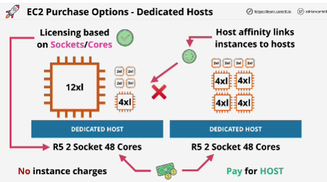

*Focus for exam: On-demand, Reserved, Spot*

**On-Demand** per-second billing (suitable for short term workloads)

**Spot**: the cheapest way to get access to EC2 capacity
(suitable for non time crittical, anything which can be rerun..)
If the spot price goes above your maximum price than any spot instances which you have are terminated. 
**Don't use spot** for anything that's long-term, anything that reqires consistent, reliable compute, any business critical things or  things which can't tolerate interruptions. 

**Reserved**: for long-term consisten usage of EC2
- Plan reservation because it's possible to purchase them and not use them!
- Reservations can be purchased for a particular type of instance and locked to an AZ specifically, or to a region.
- If you lock reservation to an AZ it means that you can only benefit when launching instances into that AZ, but it also reserves capacity.
- If you purchase reservation for a region it doesn't reserve capacity but it can benefit any instances which are launched into any AZ in that region. 

- Reservations are a way you commit to AWS that you will use resources for a lenght of time. In return to that commitment you get those resources cheaper. 
- Once you commited, you pay, whether you use those resources or not. 

Choices that you pay for reservations:
1. TERM: you can commit to AWS either for one year or for three years. 

Different payment structures:
1. NO-UPFRONT: period of one or three years, simply pay a reduced per-second fee, whether instance is running or not.
2. ALL UPFRONT: whole cost of the one or three year in advance when you purchase the reservation (no per-second fee for the instance, greatest discount)
3. PARTIAL UPFRONT: pay a smaller lump sum in advance in exchange for a lower per-second cost

Reserved instances are ideal for:
- components of infrastructure which have known usage
- require consistent access to compute 
- require on a long-term basis

Components of infrastructure that:
- require the lowest cost
- require consistent usage 
- can't tolerate any interruption

**Dedicated host** allocated to you in its entirety, pay for the host itself, which is designed for a specific family of instances.
Hosts come with all components that you would expect from a physical machine. 
**Pay for the host** - no per-second charge

Ideal for **Licensing based on Sockets/Cores** software

**Host affinity** linking instances to certain EC2 hosts. (if you stop and start the instance it remains on the same host)

# EXAM
Using Dedicated host -> for the socket and core licensing requirements. 

**Dedicated instances** run on EC2 host with other instances of yours and no other customers use the same hardware.
- Pay one-off hourly fee for any regions where you're using Dedicated instances. 
- Common in sectors of the industry where you have strictly requirements which mean that you can't share infrastructure.

**Defualt or shared model** is used for On-Demand, for Spot and for Reserved Instances.
**Dedicated hosts** offer a method where you can pay for the entire host, strict licensing reqirements
**Dedicated instances** for requirements not to share a hardware but you don't want to manage the host itself. (underlying hardware is not shared with any other AWS customers)