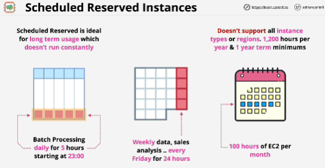
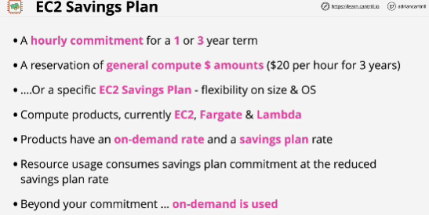

Situation where there isn't enough capacity in a region or an availability zone:
- AWS use priority order to deliver EC2 capcity:
1. AWS deliver on any commitments in terms of reserved purchases, and once they've been delivered, they can satisfy any on-demand requests, so this is priority number **two**
2. Then after both of these have been delivered, then any leftover capacity can be used via the spot purchase option.
**Capacity reservation** can be useful when you have a requirement for some compute which can't tolerate interuption.

Capacity reservation is different from reserved instance purchase. There are two different components:
**billing component, capacity component** -> both of these can be used in combination or individually

Options:
- **Regional reservation** we could purchase a reservation but make it a regional one, and this means that we can launch instances into either AZ in that region and they would benefit from the reservation in terms of billing. (they don't reserve capacity in any specific availability zone)
- with reservations, you can be more specific and pick a zonal reservation.  
**Zonal reservation** give you the same billing discounts that are delivered using regional reservations, but they also reserve capacity in a specific AZ. But they only apply to that one specific AZ and if you launch instances into another AZ in that region, you get neither benefit (you pay the full price and don't get capacity reservations)
- **On-demand capacity reservation**: you're booking capacity in specific AZ and you always pay for that capacity regardless
of if you consume it. 

You're not getting any billing benefit when using capacity reservations, you're just reserving the capacity.

## EC2 Savings Plan
- You're making a one or three year commitment to AWS in terms of hourly spend. 
- You get a reduction on the amount that you're paying for resources. 

Two types of saving plans:
1. you can make a reservation for **general compute** dollar amounts. (you can save up to 66% versus the normal on-demand price of various different compute sevices)
Valid for EC2, Fargate, Lambda
2. **EC2 savings plan**: has to be used for EC2 but offers better saving, up to 72% versus on-demand 

If you go above your savings plan, then you begin to consume the normal on demand rate. 

